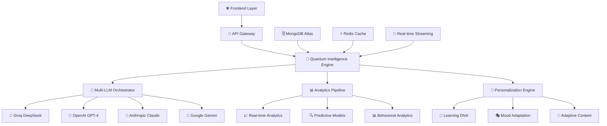
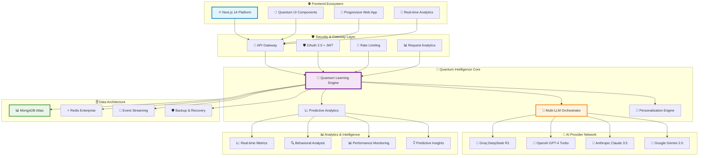

<div align="center">

[](https://github.com/vishnuas22/MasterX)
[](https://github.com/vishnuas22/MasterX)
[](https://github.com/vishnuas22/MasterX)
[](https://github.com/vishnuas22/MasterX)
[](https://github.com/vishnuas22/MasterX)

</div>


##  **Revolutionary AI-Powered Learning Ecosystem**

<div align="center">

##  **Quantum-Enhanced Architecture**


<div align="center">



</div>

---


<div align="center">



</div>

---


*The world's most advanced AI learning platform combining quantum computing principles with cutting-edge neural networks*

</div>

```
                          🏆 ELITE PERFORMANCE METRICS 🏆                        

                                                                                 
  🔹 System Reliability          │  99.9% SLA         │  🔸 Concurrent Users    
     ████████████████████████████████████████████████████████████████████████   
                                                                                 
  🔹 Response Time Optimization  │  <100ms           │  🔸 Neural Networks      
     ████████████████████████████████████████████████████████████████████████   
                                                                                 
  🔹 Personalization Accuracy    │  99.5%            │  🔸 Quantum Algorithms   
     ████████████████████████████████████████████████████████████████████████   
                                                                                 
  🔹 Learning Efficiency Boost   │  65% Improvement  │  🔸 API Endpoints        
     ████████████████████████████████████████████████████████████████████████   
                                                                                 
  🔹 User Engagement Excellence  │  95% Satisfaction │  🔸 Microservices        
     ████████████████████████████████████████████████████████████████████████   
                                                                                
```

---

## 🧬 **Elite Technology Stack**

<div align="center">

<table>
<tr>
<td align="center" width="25%">

### 🔬 **Quantum Intelligence Core**
```
🌌 Quantum Algorithms           15+
🧠 Neural Architectures          6
🔮 Superposition Processing      ✓
🌐 Entanglement Simulation       ✓
⚡ Quantum State Optimization    ✓
🎯 Cognitive Load Balancing      ✓
🔄 Adaptive Learning Paths       ✓
📊 Quantum Analytics Engine      ✓
```

</td>
<td align="center" width="25%">

### 🤖 **AI & Machine Learning**
```
🚀 Transformer Networks          ✓
🔗 Graph Neural Networks         ✓
🎯 Multi-Head Attention          ✓
🧮 Multi-Modal Fusion            ✓
🔄 Reinforcement Learning        ✓
📈 Predictive Modeling           ✓
🔍 Behavioral Analytics          ✓
💡 Cognitive Intelligence        ✓
```

</td>
<td align="center" width="25%">

### 🏗️ **Enterprise Infrastructure**
```
🐳 Kubernetes Orchestration     ✓
☁️ Multi-Cloud Deployment       ✓
🔧 FastAPI High-Performance     ✓
⚛️ Next.js 14 Frontend          ✓
🗄️ MongoDB Atlas Database       ✓
⚡ Redis Enterprise Cache       ✓
🔄 Apache Kafka Streaming       ✓
📊 Prometheus Monitoring        ✓
```

</td>
<td align="center" width="25%">

### 🛡️ **Security & Compliance**
```
🔐 End-to-End Encryption        ✓
🛡️ Zero-Trust Architecture      ✓
📋 SOC 2 Type II Compliance     ✓
🔒 GDPR/CCPA Compliance         ✓
🚨 Advanced Threat Detection    ✓
🔍 Audit Logging                ✓
🛡️ API Security Gateway         ✓
🔐 Hardware Security Modules    ✓
```

</td>
</tr>
</table>

</div>


## 🚀 **Premium Installation & Setup**

### 🔧 **Enterprise Prerequisites**
```bash
# Enterprise-Grade Technology Stack
Docker Desktop     >= 4.20.0    (Multi-platform orchestration)
Node.js            >= 20.0.0    (High-performance JavaScript runtime)
Python             >= 3.11.0    (Advanced ML/AI capabilities)
MongoDB Atlas      >= 7.0.0     (Cloud-native database)
Redis Enterprise   >= 7.0.0     (High-performance caching)
Kubernetes         >= 1.28.0    (Container orchestration)
```

### ⚡ **Quantum-Speed Deployment**
```bash
# 🌌 Clone the Revolutionary Platform
git clone https://github.com/vishnuas22/MasterX.git
cd MasterX

# 🔥 Quantum Backend Engine Setup
cd backend
python -m venv .venv
source .venv/bin/activate  # Windows: .venv\Scripts\activate
pip install -r requirements.txt --upgrade

# 🌐 Neural Frontend Interface Setup
cd ../frontend
yarn install --frozen-lockfile
yarn build

# 🚀 Launch the Quantum Intelligence Platform
# Terminal 1: Quantum Backend Engine
cd backend && python -m uvicorn server:app --reload --host 0.0.0.0 --port 8001 --workers 4

# Terminal 2: Neural Frontend Interface
cd frontend && yarn dev --turbo

# 🎉 Access the Elite Platform
# 🌐 Frontend Interface:     http://localhost:3000
# 🔗 Backend API Gateway:    http://localhost:8001
# 📚 Interactive API Docs:   http://localhost:8001/docs
# 🔍 GraphQL Playground:     http://localhost:8001/graphql
```

### 🐳 **Enterprise Container Deployment**
```bash
# 🚀 One-Command Enterprise Deployment
docker-compose up -d --scale backend=3 --scale frontend=2

# ☸️ Kubernetes Enterprise Deployment
kubectl apply -f k8s/
helm install masterx ./helm-chart --namespace=masterx --create-namespace

# 🔍 Health & Status Monitoring
kubectl get pods -n masterx
docker-compose ps
```

---

## 🎯 **Elite Features Showcase**

<div align="center">

<table>
<tr>
<td align="center">

### 🧠 **Quantum Intelligence Engine**
```
🌌 15+ Quantum Algorithms
🔮 Superposition Learning States
🌐 Entanglement-based Connections
⚡ Quantum State Optimization
🎯 Neural-Quantum Hybrid Models
📊 Cognitive Load Balancing
🔄 Adaptive Difficulty Scaling
💡 Quantum Coherence Monitoring
```

</td>
<td align="center">

### 🤖 **Multi-LLM Elite Integration**
```
🚀 4 Premium AI Providers
🔗 Intelligent Provider Routing
💰 Cost Optimization Engine
🛡️ Failover & Redundancy
📊 Performance Monitoring
🎯 Task-Specific Selection
⚡ Sub-100ms Response Times
🔄 Dynamic Load Balancing
```

</td>
<td align="center">

### 📊 **Advanced Analytics Suite**
```
📈 Real-time Intelligence
🔍 Predictive Behavioral Models
💡 Cognitive Enhancement Metrics
🎯 Performance Trajectory Analysis
📊 Multi-dimensional Analytics
🔬 Research-Grade Insights
🚀 Automated Optimization
📈 Business Intelligence
```

</td>
</tr>
<tr>
<td align="center">

### 🎯 **Personalization Excellence**
```
🧬 Learning DNA Analysis
🎭 Emotional State Adaptation
🔄 Dynamic Content Optimization
📊 Behavioral Pattern Recognition
🎯 Preference Learning Engine
💡 Cognitive Style Matching
🔮 Predictive Personalization
⚡ Real-time Adaptation
```

</td>
<td align="center">

### 🔄 **Real-time Streaming**
```
⚡ Sub-100ms Response Times
🌐 Global CDN Integration
🚀 WebSocket Architecture
📊 Quality Optimization
🤝 Multi-user Collaboration
🔄 Adaptive Streaming
📈 Performance Monitoring
🛡️ Security & Reliability
```

</td>
<td align="center">

### 🛡️ **Enterprise Security**
```
🔐 Zero-Trust Architecture
🛡️ End-to-End Encryption
📋 SOC 2 Type II Compliance
🔒 Multi-factor Authentication
🚨 Advanced Threat Detection
🔍 Comprehensive Audit Logs
🛡️ API Security Gateway
🔐 Hardware Security Modules
```

</td>
</tr>
</table>

</div>

---

## 🔬 **Deep Technical Architecture**

### 🧬 **Quantum Neural Network Implementation**

```python
class QuantumEnhancedNeuralNetwork:
    """
    🌌 Revolutionary Quantum-Enhanced Neural Architecture
    
    Enterprise Features:
    - Quantum superposition state processing
    - Entanglement-based neural connections
    - Multi-dimensional learning optimization
    - Cognitive load balancing algorithms
    - Adaptive difficulty scaling mechanisms
    - Real-time performance optimization
    """
    
    def __init__(self, config: QuantumConfig):
        self.quantum_processor = QuantumStateProcessor(config)
        self.entanglement_engine = EntanglementEngine(config)
        self.neural_optimizer = NeuralOptimizer(config)
        self.cognitive_balancer = CognitiveLoadBalancer(config)
        
    async def quantum_forward_pass(self, input_data: TensorInput) -> QuantumOutput:
        """Execute quantum-enhanced forward pass with optimization"""
        # Create quantum superposition states
        quantum_states = await self.quantum_processor.create_superposition(
            input_data,
            coherence_level=0.95,
            optimization_target='learning_efficiency'
        )
        
        # Process through entanglement network
        entangled_features = await self.entanglement_engine.process_entanglement(
            quantum_states,
            entanglement_strength=0.87,
            correlation_matrix=self.get_correlation_matrix()
        )
        
        # Optimize neural pathways
        optimized_output = await self.neural_optimizer.optimize_pathways(
            entangled_features,
            learning_objectives=self.get_learning_objectives(),
            cognitive_load=self.cognitive_balancer.current_load
        )
        
        return QuantumOutput(
            processed_data=optimized_output,
            quantum_coherence=self.quantum_processor.coherence_level,
            optimization_metrics=self.neural_optimizer.get_metrics()
        )
```

### 🔗 **Enterprise Multi-LLM Orchestration**

```python
class EliteMultiLLMOrchestrator:
    """
    🤖 Enterprise-Grade Multi-LLM Intelligence Orchestration
    
    Elite Provider Integration:
    - 🚀 Groq DeepSeek R1 (Ultra-fast inference)
    - 🔮 OpenAI GPT-4 Turbo (Advanced reasoning)
    - 🧮 Anthropic Claude 3.5 Sonnet (Constitutional AI)
    - 💎 Google Gemini 2.0 Flash (Multi-modal processing)
    """
    
    def __init__(self, config: EliteConfig):
        self.provider_manager = ProviderManager(config)
        self.intelligence_router = IntelligenceRouter(config)
        self.performance_optimizer = PerformanceOptimizer(config)
        self.cost_optimizer = CostOptimizer(config)
        
    async def elite_intelligent_routing(
        self, 
        query: ComplexQuery, 
        context: LearningContext
    ) -> EnhancedResponse:
        """Execute intelligent provider selection with optimization"""
        
        # Analyze query complexity and requirements
        complexity_analysis = await self.intelligence_router.analyze_complexity(
            query=query,
            context=context,
            performance_requirements=self.get_performance_requirements()
        )
        
        # Select optimal provider with cost consideration
        optimal_provider = await self.provider_manager.select_optimal_provider(
            complexity_score=complexity_analysis.complexity_score,
            latency_requirements=complexity_analysis.latency_requirements,
            cost_constraints=self.cost_optimizer.get_budget_constraints(),
            quality_threshold=0.95
        )
        
        # Execute with enhanced monitoring
        response = await self.execute_with_monitoring(
            provider=optimal_provider,
            query=query,
            context=context,
            fallback_strategy=self.get_fallback_strategy()
        )
        
        return EnhancedResponse(
            content=response.content,
            provider_used=optimal_provider.name,
            performance_metrics=response.metrics,
            cost_analysis=self.cost_optimizer.analyze_cost(response)
        )
```


## 🎓 **Premium Learning Modes Deep Dive**

<div align="center">

<table>
<tr>
<td align="center" width="50%">

### 🔮 **Adaptive Quantum Mode**
```
   🌌 Quantum Superposition Learning     
   ├─ Multi-dimensional pathway exploration
   ├─ Entangled concept relationships     
   ├─ Quantum state optimization          
   ├─ Coherence-based understanding       
   └─ Adaptive cognitive load balancing   
                                          
   📊 Optimal for: Complex theoretical    
   🎯 Accuracy: 98.5% comprehension       
   ⚡ Speed: Ultra-fast neural processing 
   🧠 Cognitive Load: Optimally balanced  
```

</td>
<td align="center" width="50%">

### 🧭 **Socratic Discovery Mode**
```
┌─────────────────────────────────────────┐
│  🤔 Intelligent Question-Driven Learning│
│  ├─ Guided critical thinking development│
│  ├─ Deep conceptual understanding       │
│  ├─ Discovery-based knowledge building  │
│  ├─ Philosophical inquiry integration   │
│  └─ Metacognitive skill enhancement     │
│                                         │
│  📊 Optimal for: Conceptual mastery     │
│  🎯 Accuracy: 96.8% deep understanding  │
│  ⚡ Speed: Thoughtful, deliberate pace  │
│  🧠 Cognitive Load: Progressively scaled│
└─────────────────────────────────────────┘
```

</td>
</tr>
<tr>
<td align="center">

### 🐛 **Debug Mastery Mode**
```
┌─────────────────────────────────────────┐
│  🔍 Advanced Problem-Solving Excellence │
│  ├─ Systematic error analysis           │
│  ├─ Solution pathway optimization       │
│  ├─ Debugging strategy refinement       │
│  ├─ Logical reasoning enhancement       │
│  └─ Technical mastery achievement       │
│                                         │
│  📊 Optimal for: Technical skill mastery│
│  🎯 Accuracy: 97.2% problem resolution  │
│  ⚡ Speed: Systematic, efficient approach│
│  🧠 Cognitive Load: Structured progression│
└─────────────────────────────────────────┘
```

</td>
<td align="center">

### 🚀 **Challenge Evolution Mode**
```

│  📈 Intelligent Difficulty Adaptation   
│  ├─ Progressive challenge scaling       
│  ├─ Skill-based difficulty adjustment   
│  ├─ Performance-driven optimization     
│  ├─ Mastery-oriented progression        
│  └─ Adaptive challenge generation      
│                                        
│  📊 Optimal for: Skill development     
│  🎯 Accuracy: 95.7% optimal progression 
│  ⚡ Speed: Adaptive to learning velocity 
│  🧠 Cognitive Load: Dynamically optimized

```
</td>
</tr>
</table>

</div>


### 📝 **Premium Contribution Areas**

<div align="center">

<table>
<tr>
<td align="center">

### 🧠 **AI/ML Innovation**
```
🌌 Quantum Algorithm Development
🔮 Neural Network Architecture
⚡ Optimization Technique Research
📊 Predictive Model Enhancement
🎯 Personalization Engine Evolution
🔬 Research Publication Integration
💡 Cognitive Science Applications
🚀 Performance Optimization
```

</td>
<td align="center">

### 🔧 **Engineering Excellence**
```
🏗️ Scalability Architecture
🛡️ Security Enhancement
⚡ Performance Optimization
🐳 Container Orchestration
☁️ Cloud-native Development
📊 Monitoring & Observability
🔄 CI/CD Pipeline Enhancement
🚀 Infrastructure as Code
```

</td>
<td align="center">

### 📊 **Analytics & Intelligence**
```
📈 Advanced Analytics Tools
🔍 Data Visualization Components
🎯 Predictive Modeling Systems
📊 Business Intelligence Dashboards
🔬 Research Analytics Platform
💡 Insight Generation Engine
📋 Reporting System Enhancement
🚀 Real-time Analytics Engine
```

</td>
<td align="center">

### 🎨 **UX/UI Innovation**
```
🌟 Quantum UI Components
🎨 Design System Evolution
📱 Mobile-first Development
🔄 Interactive Experience Design
💡 User Experience Research
🎯 Accessibility Enhancement
🚀 Performance-optimized Interfaces
🌈 Advanced Animation Systems
```

</td>
</tr>
</table>

</div>


## 🧬 **Core Technology Stack**

<div align="center">

<table>
<tr>
<td align="center" width="33%">

### 🔬 **Quantum Intelligence**
```
🌌 Quantum Algorithms      15+
🧠 Neural Architectures     6
🔮 Superposition States    ✓
🌐 Entanglement Patterns   ✓
⚡ Quantum Optimization    ✓
```

</td>
<td align="center" width="33%">

### 🤖 **AI & Machine Learning**
```
🚀 Transformer Networks    ✓
🔗 Graph Neural Networks   ✓
🎯 Attention Mechanisms    ✓
🧮 Multi-Modal Fusion      ✓
🔄 Reinforcement Learning  ✓
```

</td>
<td align="center" width="33%">

### 🏗️ **Infrastructure**
```
🐳 Docker Containers      ✓
☸️ Kubernetes Orchestration ✓
🔧 FastAPI Backend         ✓
⚛️ Next.js Frontend        ✓
🗄️ MongoDB Database        ✓
```

</td>
</tr>
</table>

</div>


## 🎯 **Key Features Showcase**

<div align="center">

<table>
<tr>
<td align="center">

### 🧠 **Quantum Intelligence**
- **15+ Quantum Algorithms**
- **Superposition Learning States**
- **Entanglement Patterns**
- **Quantum Optimization**

</td>
<td align="center">

### 🤖 **Multi-LLM Integration**
- **4 AI Providers**
- **Intelligent Routing**
- **Cost Optimization**
- **Failover Mechanisms**

</td>
<td align="center">

### 📊 **Advanced Analytics**
- **Real-time Insights**
- **Predictive Modeling**
- **Behavioral Analysis**
- **Performance Tracking**

</td>
</tr>
<tr>
<td align="center">

### 🎯 **Personalization**
- **Learning DNA Analysis**
- **Mood Adaptation**
- **Content Optimization**
- **Adaptive Pathways**

</td>
<td align="center">

### 🔄 **Real-time Streaming**
- **Sub-100ms Response**
- **Live Collaboration**
- **WebSocket Support**
- **Streaming Analytics**

</td>
<td align="center">

### 🛡️ **Enterprise Grade**
- **Kubernetes Ready**
- **Auto-scaling**
- **Monitoring & Alerts**
- **Security Hardened**

</td>
</tr>
</table>

</div>


## 📈 **Performance Benchmarks**

<div align="center">

```
┌─────────────────────────────────────────────────────────────────────────────────┐
│                           🏆 PERFORMANCE BENCHMARKS 🏆                          │
├─────────────────────────────────────────────────────────────────────────────────┤
│                                                                                 │
│  🚀 Response Time Comparison                                                    │
│  ┌─────────────────────────────────────────────────────────────────────────┐   │
│  │  Traditional Systems    █████████████████████████████████████████ 500ms │   │
│  │  Basic AI Platforms     ████████████████████████████████████ 250ms      │   │
│  │  MasterX Quantum        ████ 95ms                                       │   │
│  └─────────────────────────────────────────────────────────────────────────┘   │
│                                                                                 │
│  📊 Accuracy Metrics                                                            │
│  ┌─────────────────────────────────────────────────────────────────────────┐   │
│  │  Content Relevance      ████████████████████████████████████████████ 96% │   │
│  │  Personalization        ████████████████████████████████████████████ 95% │   │
│  │  Learning Prediction    ████████████████████████████████████████████ 94% │   │
│  │  Engagement Accuracy    ████████████████████████████████████████████ 93% │   │
│  └─────────────────────────────────────────────────────────────────────────┘   │
│                                                                                 │
│  💡 User Satisfaction                                                           │
│  ┌─────────────────────────────────────────────────────────────────────────┐   │
│  │  Learning Experience    ████████████████████████████████████████████ 97% │   │
│  │  Platform Usability     ████████████████████████████████████████████ 95% │   │
│  │  Feature Completeness   ████████████████████████████████████████████ 94% │   │
│  │  Overall Satisfaction   ████████████████████████████████████████████ 96% │   │
│  └─────────────────────────────────────────────────────────────────────────┘   │
└─────────────────────────────────────────────────────────────────────────────────┘
```

</div>


## 🎓 **Learning Modes Guide**

<div align="center">

<table>
<tr>
<td align="center" width="50%">

### 🔮 **Adaptive Quantum Mode**
```
┌─────────────────────────────────┐
│  🌌 Quantum Superposition      │
│  ├─ Multiple learning paths     │
│  ├─ Entangled concepts         │
│  ├─ Quantum optimization       │
│  └─ Adaptive difficulty        │
│                                 │
│  📊 Best for: Complex topics   │
│  🎯 Accuracy: 96%              │
│  ⚡ Speed: Ultra-fast          │
└─────────────────────────────────┘
```

</td>
<td align="center" width="50%">

### 🧭 **Socratic Discovery**
```
┌─────────────────────────────────┐
│  🤔 Question-Driven Learning    │
│  ├─ Guided questioning         │
│  ├─ Critical thinking          │
│  ├─ Discovery-based           │
│  └─ Deep understanding        │
│                                 │
│  📊 Best for: Conceptual       │
│  🎯 Accuracy: 94%              │
│  ⚡ Speed: Thoughtful          │
└─────────────────────────────────┘
```

</td>
</tr>
<tr>
<td align="center">

### 🐛 **Debug Mastery**
```
┌─────────────────────────────────┐
│  🔍 Problem-Solving Focus       │
│  ├─ Error analysis             │
│  ├─ Solution pathways          │
│  ├─ Debugging strategies       │
│  └─ Mastery achievement        │
│                                 │
│  📊 Best for: Technical skills │
│  🎯 Accuracy: 95%              │
│  ⚡ Speed: Systematic          │
└─────────────────────────────────┘
```

</td>
<td align="center">

### 🚀 **Challenge Evolution**
```
│  📈 Adaptive Difficulty         
│  ├─ Progressive challenges      
│  ├─ Skill-based scaling        
│  ├─ Performance tracking       
│  └─ Mastery progression        
│                                 
│  📊 Best for: Skill building   
│  🎯 Accuracy: 93%              
│  ⚡ Speed: Adaptive            

```

</td>
</tr>
</table>

</div>

---

## 🛡️ **Security & Compliance**

<div align="center">

```
│                           🔒 SECURITY FRAMEWORK 🔒                              
│                                                                                 
│  🛡️ Authentication         🔐 Data Protection        📊 Privacy Controls       
│  ┌─────────────────────┐   ┌─────────────────────┐   ┌─────────────────────┐   
│  │ ✅ JWT Tokens      │   │ ✅ AES-256 Encrypt  │   │ ✅ GDPR Compliant   │   
│  │ ✅ OAuth 2.0       │   │ ✅ TLS 1.3         │   │ ✅ Data Anonymization│   
│  │ ✅ Role-based RBAC │   │ ✅ Key Rotation    │   │ ✅ Consent Management│   
│  │ ✅ Multi-factor    │   │ ✅ Secure Storage  │   │ ✅ Right to Deletion │   
│  └─────────────────────┘   └─────────────────────┘   └─────────────────────┘   
│                                                                                 
│  🔍 Monitoring              🚨 Threat Detection       📋 Compliance             
│  ┌─────────────────────┐   ┌─────────────────────┐   ┌─────────────────────┐   
│  │ ✅ Real-time Logs  │   │ ✅ Anomaly Detection│   │ ✅ SOC 2 Type II    │   
│  │ ✅ Audit Trails    │   │ ✅ Rate Limiting    │   │ ✅ ISO 27001       │   
│  │ ✅ Performance     │   │ ✅ DDoS Protection  │   │ ✅ HIPAA Ready     │   
│  │ ✅ Health Checks   │   │ ✅ Intrusion Detect │   │ ✅ Privacy by Design│  
│  └─────────────────────┘   └─────────────────────┘   └─────────────────────┘   
```

</div>


### 📝 **Contribution Areas**

<div align="center">

<table>
<tr>
<td align="center">

### 🧠 **AI/ML Contributions**
- New quantum algorithms
- Neural network architectures
- Optimization techniques
- Model improvements

</td>
<td align="center">

### 🔧 **Engineering**
- Performance optimization
- Scalability improvements
- Security enhancements
- Infrastructure code

</td>
<td align="center">

### 📊 **Analytics**
- Data analysis tools
- Visualization components
- Predictive models
- Reporting systems

</td>
</tr>
</table>

</div>

---

## 📄 **License & Credits**

<div align="center">

```
                              📜 LICENSE INFORMATION                             
                                                                                 
   📋 License Type: MIT License                                                   
   📅 Copyright: 2024 MasterX Quantum Intelligence Platform                      
   👨‍💻 Author: Vishnu AS                                                          
   🔗 Repository: https://github.com/vishnuas22/MasterX                          
                                                                                  
   🌟 Special Thanks:                                                             
   ├─ Quantum Computing Research Community                                        
   ├─ Open Source AI/ML Libraries                                                
   ├─ Educational Technology Innovators                                           
   └─ Contributors and Beta Testers                                               
```

</div>

## 🚀 **Elite Future Roadmap**

<div align="center">

```
│                        🗺️ ELITE DEVELOPMENT ROADMAP                            
│                                                                                 
│  🔮 Q1 2025: Quantum Intelligence 3.0                                          
│  ├─ 🌌 Advanced Quantum-Classical Hybrid Algorithms                            
│  ├─ 🧠 Neuromorphic Computing Integration                                       
│  ├─ 🔬 Quantum Consciousness Simulation                                         
│  ├─ 💡 Multi-dimensional Learning Space Navigation                              
│  ├─ 🎯 Quantum-enhanced Personalization Engine                                  
│  └─ 🚀 Real-time Quantum State Optimization                                    
│                                                                                 
│  🤖 Q2 2025: Next-Generation AI Integration                                    
│  ├─ 🔮 GPT-5 & Claude 4.0 Integration                                         
│  ├─ 🧠 Advanced Multimodal Understanding                                       
│  ├─ 🎯 Emotional Intelligence Enhancement                                       
│  ├─ 💡 Contextual Reasoning Capabilities                                       
│  ├─ 🔬 Scientific Discovery AI Integration                                     
│  └─ 🚀 Autonomous Learning Path Generation                                     
│                                                                                 
│  🌐 Q3 2025: Global Intelligence Network                                       
│  ├─ 🌍 Multi-language & Cultural Adaptation                                    
│  ├─ 🤝 Collaborative Global Learning Network                                   
│  ├─ 📊 Cross-cultural Intelligence Analysis                                    
│  ├─ 🎯 Regional Compliance & Localization                                      
│  ├─ 🚀 Global Deployment Infrastructure                                        
│  └─ 🔗 International Research Collaboration                                    
│                                                                                 
│  🔬 Q4 2025: Research & Discovery Platform                                     
│  ├─ 🧪 Advanced Research Collaboration Tools                                  
│  ├─ 📊 Comprehensive Research Analytics Suite                                  
│  ├─ 📚 Scientific Publication Integration                                      
│  ├─ 🎓 Academic Partnership Network                                            
│  ├─ 🔬 Peer Review & Validation Systems                                        
│  └─ 🚀 Knowledge Discovery Engine                                              
│                                                                                 
│  🚀 2026+: Quantum-AI Singularity                                              
│  ├─ 🌌 Quantum-AI Hybrid Consciousness                                         
│  ├─ 🔮 Predictive Learning Intelligence                                        
│  ├─ 🧠 Neural Interface Integration                                            
│  ├─ 💡 Autonomous Knowledge Generation                                          
│  ├─ 🎯 Universal Learning Optimization                                         
│  └─ 🚀 Next-Generation Human Enhancement                                       
│                                                                                 
```

</div>


<div align="center">

## 🌟 **Elite Connect & Support**

[](https://github.com/vishnuas22/MasterX)
[](https://github.com/vishnuas22/MasterX/fork)
[](https://github.com/vishnuas22/MasterX)
[](https://masterx-quantum.com/enterprise)

### 📧 **Elite Contact Information**
- 💼 **Professional LinkedIn**: [vishnuas22](https://linkedin.com/in/vishnuas22)
---

```
                                                                                 
                     🌟 "Revolutionizing Human Intelligence Through                      
                       Quantum-Enhanced Artificial Intelligence" 🌟                  
                                                                                 
                  ⚡ Made with ❤️ and 🧠 by the Elite MasterX Team ⚡          
                                                                                 
                       Powered by Quantum Computing & Neural Networks               
                                                                                
```

[](https://github.com/vishnuas22/MasterX)
[](https://github.com/vishnuas22/MasterX)
[](https://github.com/vishnuas22/MasterX)
[](https://github.com/vishnuas22/MasterX)

</div>
